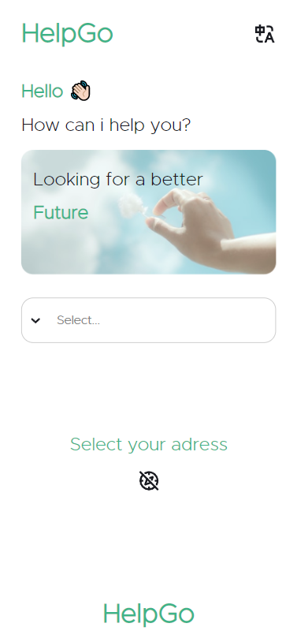

<p align="center">
  
</p>

<br>

## Justificativa

Desenvolvimento de um aplicativo de autoajuda de geolocalização para extrangeiros

## Inicializar Projeto Através do NPM


Nosso primeiro passo é clonar o projeto e entrar na pasta do projeto;

```bash
$ git clone https://github.com/Matheuscara/Library-Places-Front
```

O proximo passo é baixar as bibliotecas e iniciar o projeto;

```bash
npm install
npm start
```
## Tecnologias:

O desenvolvimento se consiste em tais bibliotecas:

- [React](https://reactjs.org)
- [Redux toolkit](https://redux-toolkit.js.org/)
- [Redux](https://redux.js.org/)
- [react-router-dom](https://www.npmjs.com/package/react-router-dom)
- [Google Places API](https://www.google.com/places/api)
- [Back-End](https://github.com/Matheuscara/library-places-back-nd)

## Justificativa de Arquitetura e Bibliotecas:

A minha intenção foi desenvolver uma solução que pudesse ser escalável, criando componentes e formas de produzir uma codificação mais simples para o futuro, contudo, gerou uma complexidade no código inicial.

---
- typescript:
  - Tipagem de contextos, gerando menos problemas para o futuro.
---
- Redux, Redux Toolkit:
  - Contexto de variáveis em todos os componentes, independente da árvore de props.
---
- react-router-dom:
  - Roteamento mais facilitado e possibilidade de contexto por url.
---
